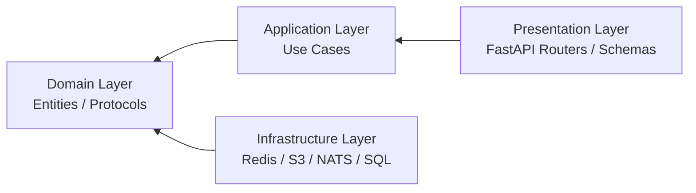

# Clean Architecture Layers

To ensure modularity, testability, and decoupling from external dependencies, this project strictly adheres to the **Clean Architecture** paradigm.

---

## 1. The Inward Dependency Flow

All code dependencies must flow inwards towards the pure **Domain Layer**. Inner layers must never import or depend on outer layers.

**Presentation** &rarr; **Application** &rarr; **Domain** &larr; **Infrastructure (via Protocols)**

---

## 2. Layer Specifications

### A. Domain Layer (`src/domain/`)

The core heart of the application. It represents pure business logic, enterprise models, and abstract interfaces.

- **Dependencies**: **Strictly zero**. It cannot import from outer layers or depend on third-party libraries (like database ORMs or framework-specific utilities).
- **Key Contents**:
    - **Entities & Value Objects** (`src/domain/entities/`): Objects with unique identity (e.g., `UploadSession`, `Chunk`).
    - **Protocols** (`src/domain/protocols/`): Abstract interfaces using `typing.Protocol` defining contracts for storage, events, and utilities (e.g., `SessionRepository`, `ObjectStorage`, `VirusScanner`).
    - **Exceptions** (`src/domain/exceptions.py`): Domain-level exceptions representing core business errors (e.g., `ChecksumMismatchError`).

### B. Application Layer (`src/application/`)

Orchestrates application use cases, transaction boundaries, and coordinates the business flow.

- **Dependencies**: Only depends on the **Domain Layer**. It cannot import from presentation or infrastructure.
- **Key Contents**:
    - **Use Cases** (`src/application/use_cases/`): Business logic workflows (e.g., `InitiateUploadUseCase`, `UploadChunkUseCase`, `FinalizeUploadUseCase`).

### C. Infrastructure Layer (`src/infrastructure/`)

Handles low-level technical details, external databases, message brokers, and integration wrappers.

- **Dependencies**: Depends on the **Domain** and **Application** layers via abstract protocols.
- **Key Contents**:
    - **Redis Adapters** (`src/infrastructure/redis/`): Core implementations of `SessionRepository` and `ChunkRepository`.
    - **S3 Adapters** (`src/infrastructure/s3/`): Implements `ObjectStorage` using standard `boto3`.
    - **NATS Adapters** (`src/infrastructure/nats/`): Implements `EventPublisher`.
    - **Security Adapters** (`src/infrastructure/security/`): Implements the `VirusScanner` wrapper.

### D. Presentation Layer (`src/presentation/`)

The entry point of external requests (FastAPI routers, HTTP request/response schemas, JWT validation, and middleware).

- **Dependencies**: Depends strictly on the **Application Layer**.
- **Key Contents**:
    - **Routers** (`src/presentation/api/v1/`): FastAPI route handlers (e.g., `/v1/uploads`).
    - **Schemas** (`src/presentation/api/schemas/`): Pydantic models for validation.
    - **Dependencies & DI** (`src/presentation/dependencies.py`): Resolves dependency injection at runtime, injecting concrete infrastructure classes into application use cases.

---

## 3. Strict Architectural Rules

1.  **Dependency Inversion Principle (DIP)**: Concrete infrastructure adapters are injected at runtime via the Presentation layer. Use cases only depend on abstract protocols.
2.  **No Direct Imports**: `Domain` or `Application` must never import from `Infrastructure` or `Presentation`. Any violations will fail lint checks.
3.  **Data Mappings**: Request schemas (Pydantic) belong strictly in the Presentation layer. They must be mapped to pure Domain Entities before passing them down to the Application layer.
