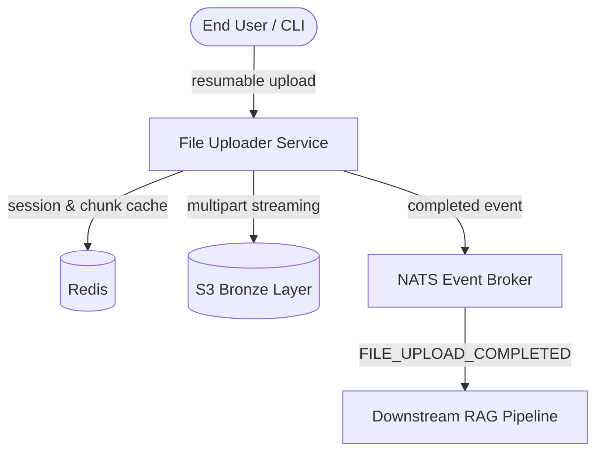
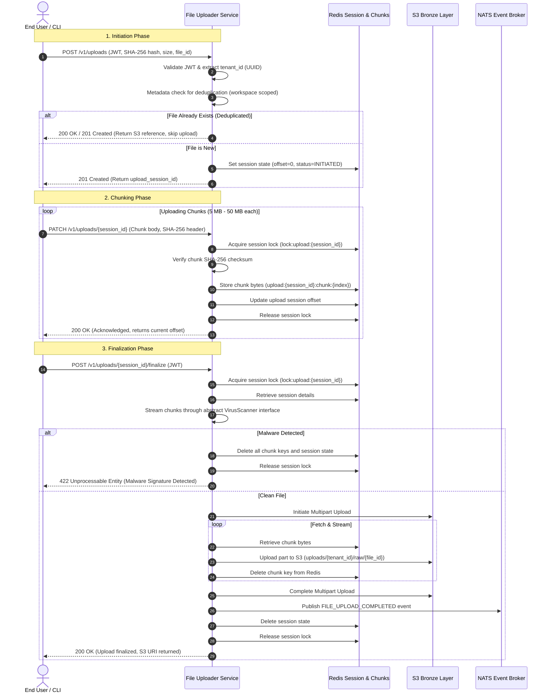

# Architectural Design & Flow

This page details the high-performance, fault-tolerant architectural design of the **File Uploader Service**. The service is built to handle large-file uploads (up to 1 GB) at the ingestion boundary of the data pipeline, ensuring complete reliability, safety, and stateless scalability.

---

## 1. System Architecture

The microservice acts as a stateless boundary layer coordinating between transient fast storage (Redis), long-term immutable object storage (S3/MinIO), and down-stream RAG event consumers (NATS JetStream).

---

## 2. Core Architectural Decisions

### A. Transient Chunk Storage in Redis

To support reliable chunked uploads up to 1 GB, individual binary segments are stored as independent keys in Redis:

- **Key format**: `upload:{session_id}:chunk:{index}`
- **Benefits**: Supports parallel chunk uploads, decoupled validation of each segment, and zero state on the service containers.
- **Persistence**: Redis is configured with Append-Only File (AOF) persistence to prevent data loss in the event of container restarts.

### B. Sequential S3 Multipart Streaming

To keep the memory footprint locked to a single chunk (~25 MB) even for 1 GB files:

- Chunks are retrieved one-by-one from Redis during finalization.
- They are streamed sequentially using S3 Multipart Upload.
- Once successfully sent, chunks are instantly purged from Redis, avoiding memory spikes or Out-Of-Memory (OOM) failures.

### C. In-Stream Virus Scanning

- Instead of scanning chunks individually (which fails to detect signatures split across boundaries), the file stream is passed through an abstract `VirusScanner` interface during finalization.
- If malware is detected, the S3 multipart upload is immediately aborted, all cached Redis chunks are destroyed, and the request is rejected with `422 Unprocessable Entity`.

### D. Pre-Upload Tenant-Scoped Deduplication

- Before beginning an upload session, the client provides the SHA-256 hash of the entire file.
- The server queries the workspace-scoped metadata registry.
- If the file exists within the tenant workspace, it returns the S3 path immediately (`200 OK / 201 Created`), bypassing the upload entirely.

### E. Concurrency Control (Distributed Locks)

- A single-key distributed lock (`lock:upload:{session_id}`) is acquired in Redis during `PATCH` (chunk upload), `POST /finalize`, and `DELETE /abort` operations.
- This prevents race conditions on session offset or assembly under parallel uploads.

---

## 3. End-to-End Execution Sequence

The sequence diagram below showcases the three primary phases of the upload lifecycle: **Initiation**, **Chunking**, and **Finalization**.

