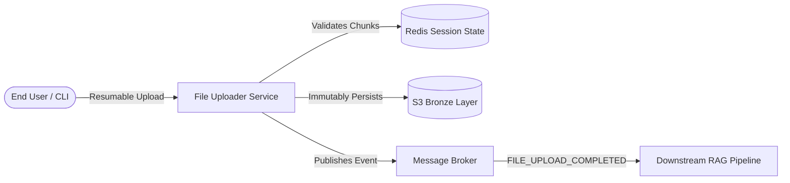

# File Uploader Service

<p align="center">
  <strong>A high-performance, fault-tolerant ingestion boundary for production RAG platforms.</strong>
</p>

---

## 1. Executive Summary

RAG platforms are only as good as the knowledge they ingest. When a 600 MB PDF silently fails mid-upload, the knowledge base is incomplete — and the AI answers users receive are wrong in ways no one can easily detect. This is the **silent killer of production RAG deployments**.

**File Uploader Service** is a dedicated ingestion microservice that solves large-file reliability at the boundary of the data pipeline. It accepts PDF documents up to 1 GB from end users, transfers them via fault-tolerant chunked uploads with per-segment integrity verification, stores them immutably on S3 as the bronze-layer source of truth, and fires a `FILE_UPLOAD_COMPLETED` event to trigger all downstream processing — chunking, embedding, indexing — without coupling any of those concerns to the upload path.

Built as a standalone REST API consumed by a CLI application, it gives knowledge workers a professional-grade upload experience with deduplication, virus scanning, and multi-file batch support — the kind of reliability that transforms a RAG prototype into a production-grade knowledge platform.

---

## 2. The Problem & The Solution

!!! danger "The Problem: Ingestion Failures degrade RAG performance"
    Large-file uploads over HTTP are inherently unreliable. A single network hiccup at byte 480 MB of a 500 MB file means starting over. For end users building personal or team knowledge bases from dense technical PDFs, legal corpora, or research archives, this is a workflow blocker.

    The consequences compound silently downstream:

    *   **Direct S3 uploads** lack progress tracking, resumability, and integrity guarantees.
    *   **Generic upload libraries** are not designed for the RAG pipeline contract (bronze storage + event trigger).
    *   **Silent Corruptions** produce broken vector embeddings, degrading RAG responses with no obvious cause.

### The Solution: Tus-Inspired Chunked Uploads

The service implements a robust, chunked upload API with independent verification and session recovery. Upload progress is tracked atomically in Redis with a 24-hour time-to-live (TTL).

#### Version 1 REST API Contract

| Method   | Endpoint                          | Description                                                                      |
| :------- | :-------------------------------- | :------------------------------------------------------------------------------- |
| `POST`   | `/v1/uploads`                     | Initiate a new upload session, returns an `upload_session_id` and resets offset. |
| `PATCH`  | `/v1/uploads/{upload_session_id}` | Upload an individual chunk with a SHA-256 verification header.                   |
| `HEAD`   | `/v1/uploads/{upload_session_id}` | Query the upload session state and current offset (enables resumability).        |
| `DELETE` | `/v1/uploads/{upload_session_id}` | Abort the upload session and clean up all temporary chunks.                      |

---

## 3. What Makes This Different?



!!! info "Bronze Layer as the Source of Truth"
Files land on S3 in their original, unmodified form before any processing occurs. This enables full re-processing pipelines without requiring user re-upload, complete audit trails, and recovery from any downstream failure.

!!! success "Per-Chunk Integrity Verification"
SHA-256 verification per chunk catches corruption at the boundary. A corrupt chunk is rejected immediately with a `460 Checksum Mismatch` response, and the client only needs to retry that single chunk.

!!! check "Deduplication & Safety"
Before persisting to the bronze layer, uploads are checked for deduplication (within tenant workspaces) and scanned for viruses, ensuring downstream processing remains clean and safe.

---

## 4. Technical Scope (v1)

### In Scope

- **Format**: PDF file type (configurable max size up to 1 GB).
- **Protocol**: Chunked, resumable upload with per-chunk SHA-256 verification.
- **Storage**: S3 bronze-layer persistence.
- **Events**: `FILE_UPLOAD_COMPLETED` publication to the message broker.
- **Deduplication**: Tenant-scoped file deduplication.
- **Security**: JWT-based authentication, per-tenant workspace isolation, and virus scanning before storage commit.
- **Observability**: Prometheus metrics (`upload_chunks_total`, `upload_bytes_total`, `chunk_verification_failures_total`).

---

## 5. Success Criteria

!!! success "Performance & Reliability Goals" - **10 concurrent workers** uploading up to 500 MB files without data loss or corruption. - **Zero silent failures** — every upload either succeeds verifiably or returns a clear, actionable error. - **100% detection** of corrupted segments via SHA-256. - **Prometheus observability** with granular tracking of speeds, sizes, and failures.

---

## 6. Quick Start

Ensure you are working within the isolated developer environment:

```bash
# 1. Clone the repository
git clone https://github.com/valeriu-pirtac/py-file-uploader-service
cd py-file-uploader-service

# 2. Setup the environment & dependencies via Flox
make setup

# 3. Configure environment variables
cp .env.example .env

# 4. Start the local development server
make dev
```

The interactive API documentation will be available at [http://localhost:8000/docs](http://localhost:8000/docs).

---

## 7. Future Vision

File Uploader Service begins as the PDF ingestion boundary of one RAG platform. It's going to evolve into a **universal ingestion hub** that accepts all media types (audio, video, images, structured data) with format-aware pre-processing hooks, global deduplication, and extensible event-driven pipelines.
